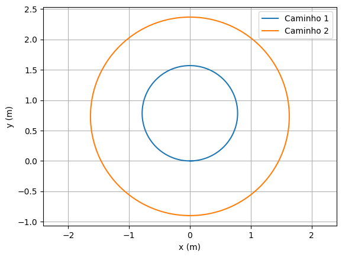
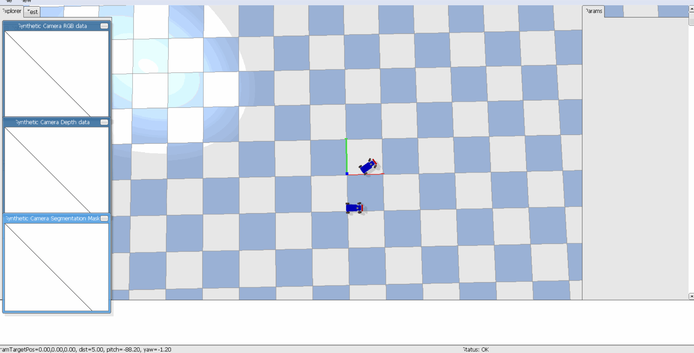
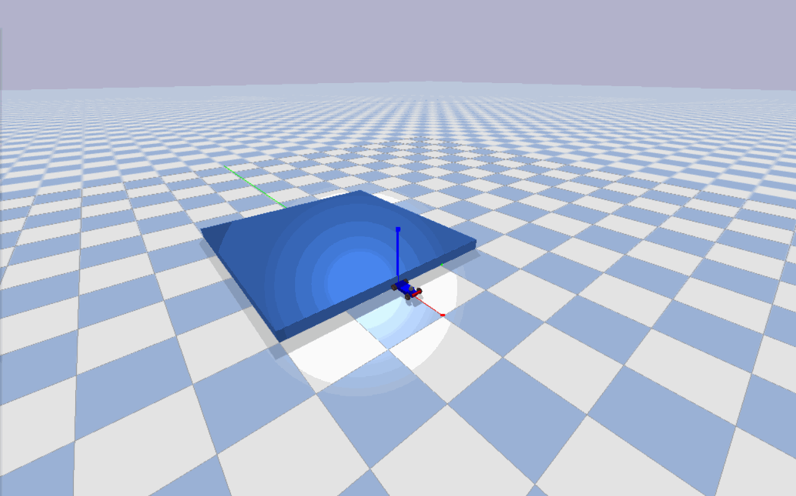

# Sobre os projetos
Neste repositório foram desenvolvidos dois projeto. Que estarão descritos abaixo.

## Projeto 1
O projeto consiste em fazer dois carros, no qual, cada um seguirá por dois caminhos circulares concêntricos. A figura abaixo mostra a trajetória dos veículos

As animações abaixo mostra o percurso realizado pelos carros

Animação 1

Animação 2

## Projeto 2
O objetivo dessa simulação é fazer o carro manter uma distância de 1 metro do anteparo. Dessa forma, ao deslocar o anteparo o veículo deverá segui-lo mantendo a distância de referência. O tempo de resposta e o erro (diferença entre a distância do carro e a distância de referência) serão os menores possíveis. Para atingir esse objetivo, as constantes (Kp e Ki) do controlador foram variadas até encontrar o melhor resultado de forma empirica.

A animação abaixo mostra a deslocamento do veículo juntamente com o anteparo.

Animação 3

# Programas e bibliotecas necessárias
Necessário instalar as ferramentas de compilação do Microsoft C++ pelo seguinte link:
- https://visualstudio.microsoft.com/pt-br/visual-cpp-build-tools/

OBS: Instalar ferramentas para desenvolvedor (tamanho é aproximadamente de 7GB).

Além disso, é necessário instalar o Python e as bibliotecas no arquivo `requirements.txt`.
